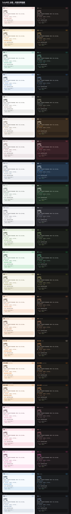

# SoloMD Themes · 双模式皮肤主题

> 一座为 SoloMD（Markdown 编辑器 / 阅读器）准备的私人调色博物馆 🎨
> 24 套精心调校的配色，每套都自带 **日间 / 夜间** 双模式——白天是信笺，深夜是墨夜。

---

## ✨ 特性

- 🌗 **双模式**：每套主题都内置 `light` + `dark` 两套 CSS 变量，可跟随系统或手动切换。
- 🎨 **多种配色**：暖色、冷色、中性、绿、橙、粉、蓝色系，总有一款合你眼缘。
- 🧩 **即插即用**：纯 CSS 变量，零依赖、零构建，复制即用。
- 🖼️ **并排对照**：左右对照每套主题的「日间 ｜ 夜间」面貌。

---

## 🎨 主题一览

